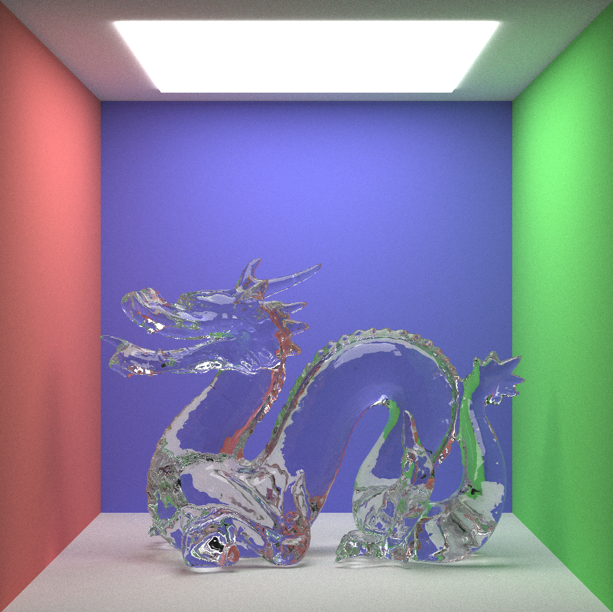

# Path Tracer y Tone Mapper
* Autor: Fernando Peña Bes
* Autor: José Daniel Subías Sarrato

*Informática Gráfica - Universidad de Zaragoza, curso 2020-21*

# Descripción
Este repositorio contiene un Path Tracer, que resuelve la ecuación de render
mediante Monte Carlo y Muestreo por Importancia, y un Tone Mapper, capaz de
convertir las imágenes en alto rango dinámico que genera el Path Tracer (con
un formato PPM modificado) en imágenes PPM estándar que se puedan visualizar.

En el [informe](doc/pathtracer_report.pdf) se explica en detalle la implementación de los programas.


# Compilación
Se ha utilizado CMake como sistema de compilación. Para construir los
Makefiles del proyecto ir al directorio raíz y ejecutar

    cmake -B build

Este comando creará un directorio llamado `build` con todos los ficheros
necesarios para la compilación.

A continuación, acceder a dicho directorio y ejecutar `make` para compilar
tanto el Path Tracer como el Tone Mapper. Si se quieren compilar por
separado, se puede ejecutar `make path_tracer` y `make tone_mapper`
respectivamente.

# Ejecución
Una vez que se ha completado la compilación, en el directorio `build` se
encontrarán los binarios de los dos programas.

El Path Tracer se puede ejecutar con los siguientes argumentos:

```
Usage: path_tracer [options ...]

Options:
  Output file options:
    -o, --out_file FILE     Output file name (default image_hdr.ppm)
    -w, --width WIDTH       Output image width (default 800)
    -h, --height HEIGHT     Output image height (default 800)
    -c, --color_res RES     Output image color resolution (default 10000000) 
  Rendering options:
    -p, --pixel_paths PPP   Number of paths per pixel (default 100)
    -t, --threads N         Number of hardware concurrent threads (default max. threads)
    -s, --scene N           Scene to render
                              [0-10] (default 0)
    -i, --integrator TYPE   Integrator to solve the rendering equation
                              [pathtracing, raytracing, normals] (default pathtracing)
  -?, --help                Show this help message and quit
```

El Tone Mapper permite guardar imágenes con formato .ppm o .hdr (Radiance
HDR). Por defecto usa PPM. Se ejecuta de la siguiente forma:

```
Usage: tone_mapper input-file.ppm [options ...] [output-file.{ppm|hdr}]

Options:
  -exposure STEP        Multiply each pixel by 2^STEP to adjust the exposure
  -clamp                Discard all values greater than 255 (1 in floating point precision)
  -equalize             Linear transformation of all values from minimum to the maximum (normalization)
  -clamp-and-equalize VALUE
                        Clamp all values greater than VALUE and equalize the rest of them
  -gamma-curve GAMMA    Apply a gamma curve to all the values
  -clamp-and-gamma-curve VALUE GAMMA
                        Apply a gamma curve after clamping all the values greater than VALUE
  -reinhard02 A L       Apply the Reinhard 2002 operator with a given A key value and L value
  -mantiuk08 A S        Apply the Mantiuk 2008 operator with a given A key value and S value
  -?, -h, -help         Show this help message and quit

Use the string 'default' as argument value to use the default value
Default values:
  STEP = 1
  VALUE = 1
  GAMMA = 2.2
  A = 0.16
  L = 0.7
  S = 0.6

If no output-file is provided, the image is saved as: out_'input-file'.ppm
```

El Tone Mapper se puede utilizar para convertir imágenes .ppm en .hdr si no
se indica ningún operador de tone mapping.

# Integradores
El Path Tracer permite renderizar la imagen usando uno de los siguientes integradores,
que se encargan de resolver la ecuación de render:

- Path Tracing (`-i pathtracing`), por defecto
- Ray Tracing (`-i raytracing`)
  > Nota: Sólo permite renderizar la iluminación de luces puntuales.
- Mapa de normales (`-i normals`)

|Path Tracing|Ray Tracing|Mapa de normales|
|:---:|:---:|:---:|
||||

# Escenas
El Path Tracer tiene varias escenas ya configuradas. Se pueden seleccionar
utilizando la opción `-s` seguida de uno de los siguientes números.

0. Contiene dos esferas, una dieléctrica con un índice de refracción de 1,5 y
otra de material plástico. Está iluminada con una luz de área en el techo.
Esta es la escena que se usa por defecto si no se selecciona ninguna o se
selecciona una que no existe.
1. Es igual que la escena 0, pero la luz de área se ha sustituido por una luz
puntual.
2. Contiene tres conejos, uno con material especular, otro dieléctrico y otro
plástico.
3. Contiene un dragón con material dieléctrico.
4. Tiene tres esferas, una detrás de otra, y la cámara es de tipo *thin lens*.
5. Está formada por varias esferas dielécticas y difusas.
6. Ejemplo de mapeo de texturas.
7. Escena de la primera sección.

|Escena 2|Escena 3|
|:---:|:---:|
|||

|Escena 4|Escena 6|
|:---:|:---:|
|||

En el fichero `path_tracer/sample_scenes.hpp` hay muchos ejemplos de escenas,
y pueden servir como guía para crear escenas nuevas.

# Visualización de imágenes
Las imágenes se generan con un formato PPM modificado para guardar imágenes
HDR, que no se puede abrir con programas de visualización de imágenes. Para
poder ver los resultados hace falta aplicar Tone Mapping sobre la imagen.

El siguiente es un ejemplo completo para poder generar y visualizar una
imagen:

    build/path_tracer -s 1 -p 40 -o imagen_hdr
    build/tone_mapper imagen_hdr.ppm -clamp-and-gamma-curve 1 2.2 imagen.ppm
    display imagen.ppm

La mayoría de visores de imágenes soportan el formato PPM.
